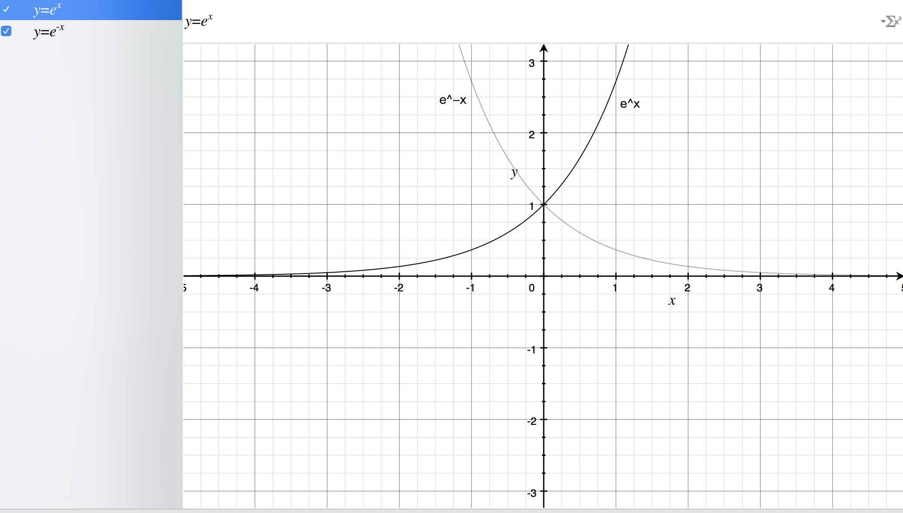
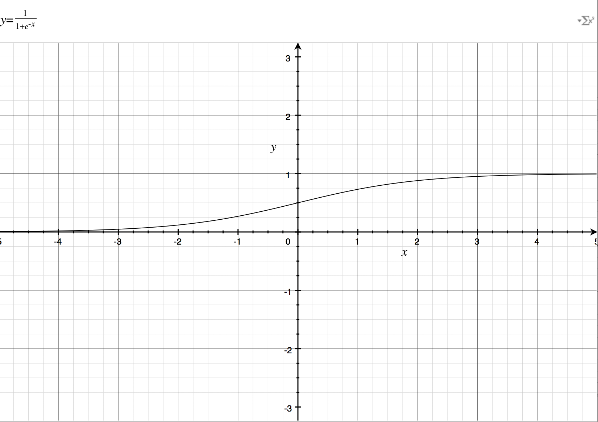
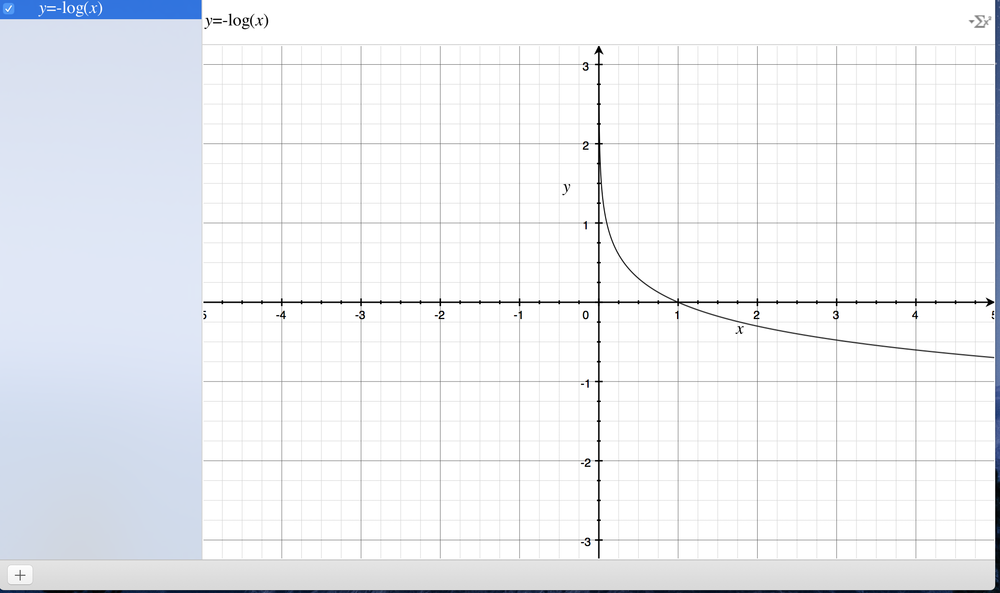
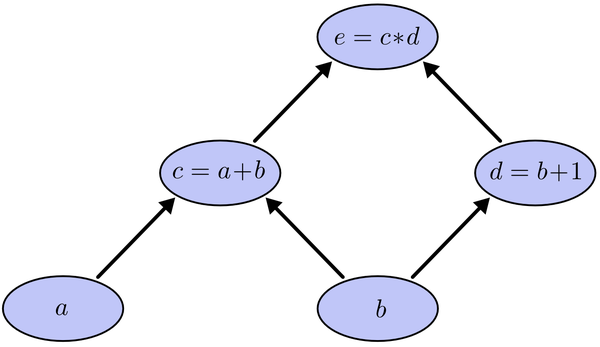
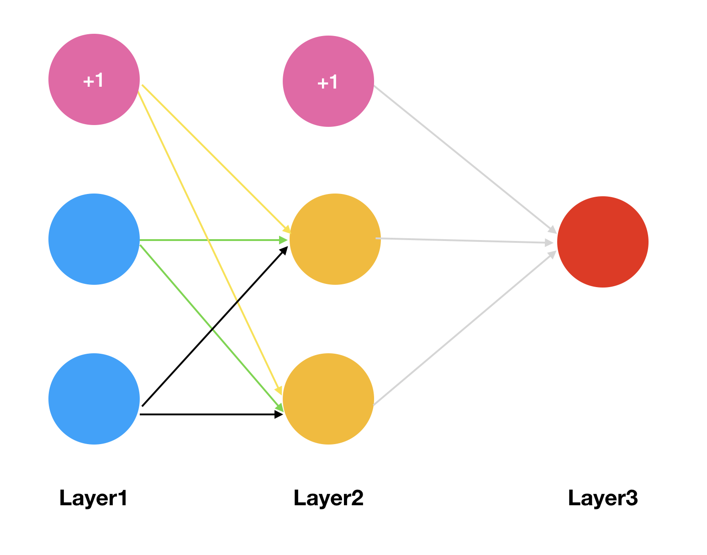

# Sigmoid函数与神经网络损失函数求导

## 1、sigmoid函数
   sigmoid函数，也就是s型曲线函数，如下：

$$
函数：f(z)=\frac{1}{1+e^{-z}}
$$

$$
导数：f'(z)=f(z)(1-f(z))
$$

   上面是我们常见的形式，虽然知道这样的形式，也知道计算流程，不够感觉并不太直观，下面来分析一下。

### 1.1 从指数函数到sigmoid

   首先我们来画出指数函数的基本图形：

  

   从上图，我们得到了这样的几个信息，指数函数过(0,1)点，单调递增/递减，定义域为$(-\infty,+\infty)$，值域为$(0,+\infty)$，再来我们看一下sigmoid函数的图像：

   如果直接把$e^{-x}$放到分母上，就与$e^{x}$图像一样了，所以分母加上1，就得到了上面的图像，定义域是$(-\infty,+\infty)$，值域是$(0,1)$，那么就有一个很好地特性了，就是不管$x$是什么，都可以得到$(0,1)$之间的值；

### 1.2 对数函数与sigmoid

   首先来看一下对数函数的图像：

        

   对数函数的图像如上，单调递减，有一个比较好的特性就是在$(0,1)$之间，在接近0的时候，就近无穷大，接近1的时候为0，如果我们把前面的sigmoid函数放到自变量的位置上，就得到了$(0,1)$的图像；

   我们如何来衡量一个结果与实际计算值得差距呢？一种思路就是，如果结果越接近，差值就越小，反之越大，这个函数就提供了这样一种思路，如果计算得到的值越接近1，那么那么表示与世界结果越接近，反之越远，所以利用这个函数，可以作为逻辑回归分类器的损失函数，如果所有的结果都能接近结果值，那么就越接近于0，如果所有的样本计算完成以后，结果接近于0，就表示计算结果与实际结果非常相近。

## 2、sigmoid函数求导

   sigmoid导数具体的推导过程如下：
$$
\begin{aligned}f'(z) &= (\frac{1}{1+e^{-z}})' \\&= \frac{e^{-z}}{(1+e^{-z})^{2}} \\&= \frac{1+e^{-z}-1}{(1+e^{-z})^{2}}  \\&= \frac{1}{(1+e^{-z})}(1-\frac{1}{(1+e^{-z})}) \\&= f(z)(1-f(z))\\\end{aligned}
$$

## 3、神经网络损失函数求导

   神经网络的损失函数可以理解为是一个多级的复合函数，求导使用链式法则。

$$\begin{gather*} J(\Theta) = - \frac{1}{m} \sum_{i=1}^m \sum_{k=1}^K \left[y^{(i)}_k \log ((h_\Theta (x^{(i)}))_k) + (1 - y^{(i)}_k)\log (1 - (h_\Theta(x^{(i)}))_k)\right] + \frac{\lambda}{2m}\sum_{l=1}^{L-1} \sum_{i=1}^{s_l} \sum_{j=1}^{s_{l+1}} ( \Theta_{j,i}^{(l)})^2\end{gather*}$$

   先来说一下常规求导的过程：

        $e = (a+b)(b+1)$

   这是一个简单的复合函数，如上图所示，c是a的函数，e是c的函数，如果我们用链式求导法则，分别对a和b求导，那么就是求出e对c的导数，c对a的导数，乘起来，对b求导则是求出e分别对c和d的导数，分别求c和d对b的导数，然后加起来，这种方法使我们常规的做法，有一个问题就是，我们在求到的过程中，e对c求导计算了2次，如果方程特别复杂，那么这个计算量就变得很大，怎样能够让每次求导只计算一次呢？

   如上图所示，我们从上往下开始计算，将每个单元的值计算出来，然后计算每个单元的偏导数，保存下来；

   接下来继续计算子单元的值，子单元的偏导数，保存下来；将最后的子单元到根节点所在的路径的所有偏导乘起来，就是该函数对这个变量的偏导，计算的本质就是从上往下，计算的时候将值存起来，乘到后面的单元上去，这样每个路径的偏导计算只需要一次，从上到下计算一遍就得到了所有的偏导数。

   实际上BP(Backpropagation，反向传播算法)，就是如此计算的，如果现在有一个三层的神经网络，有输入、一个隐藏层，输出层，我们对损失函数求权重的偏导数，它是一个复杂的复合函数，如果先对第一层的权重求偏导，然后在对第二层的权重求偏导，会发现，其中有很多重复计算的步骤，就像上面的简单函数的示例，所以，为了避免这种消耗，我们采用的就是从后往前求偏导，求出每个单元的函数值，求出对应单元的偏导数，保存下来，一直乘下去，输入层。

   下面用一个简单的示例来演示一下反向传播求偏导的过程：  

   那么我们会有两个初始的权重矩阵：
$$
\begin{aligned}\theta^{1} =\begin{bmatrix}\theta^1_{10} &\theta^1_{11}& \theta^1_{12}\\\theta^1_{20} &\theta^1_{21}& \theta^1_{22}\end{bmatrix}\\\\\theta^{2} =\begin{bmatrix}\theta^2_{10} &\theta^2_{11}& \theta^2_{12}\end{bmatrix}\end{aligned}
$$
   我们得到了上面的矩阵，现在我们以$sigmoid$函数作为激活函数，分别来计算每一层网络的激励（假设我们只有一个样本，输入是$x_1,x_2,$输出是$y$）；

   第一层是输入，激励就是样本的特征值；记为:
$$
\begin{aligned}
a^1 = 
\begin{bmatrix}
x_0
\\
x_1
\\
x_2
\end{bmatrix}
\end{aligned}
$$
        $x_0$是偏置项，为1.

   第二层是隐藏层，激励通过特征值与区中相乘得到，然后取sigmoid函数变换，得到$a^2$，未变换之前的记为$z^2$：
$$
\begin{aligned}z^2_1 &=  \theta^1_{10} *x_0 + \theta^1_{11}*x_1+\theta^1_{12} * x_2\\z^2_2 &=  \theta^1_{20} *x_0 + \theta^1_{21}*x_1+\theta^1_{22} * x_2\\z^2 &= \begin{bmatrix}z^2_1\\z^2_2\end{bmatrix}\\a^2 &= sigmoid(z^2)\\a^2 &= \begin{bmatrix}1\\a^2_1\\a^2_2\end{bmatrix}\\\end{aligned}
$$
   在上面，我们最后加上了偏置项；

   接下来第三层是输出层：
$$
\begin{aligned}z^3_1 &=  \theta^2_{10} *a^2_{0} + \theta^2_{11}*a^2_{1}+\theta^2_{12} * a^2_{2}\\z^3 &=\begin{bmatrix}z^3_1\end{bmatrix}\\a^3 &= sigmoid(z^3)\\a^3 &= \begin{bmatrix}a^3_1\end{bmatrix}\\\end{aligned}
$$
   因为是输出层了，所以不需要再往下计算，所以不加偏置项；

   上面的计算流程，从输入到输出，我们也称为前向传播(Forward propagation)。

   然后，我们根据损失函数，写出损失函数的公式，在这里，只有一个输入，一个输出，所以损失函数写出来较为简单：

   在这里，m=1;
$$
\begin{aligned}J(\Theta) &= - \frac{1}{m}  \left[y^{(i)}_k \log ((h_\Theta (x^{(i)}))_k) + (1 - y^{(i)}_k)\log (1 - (h_\Theta(x^{(i)}))_k)\right] + \frac{\lambda}{2m}\sum_{l=1}^{L-1} \sum_{i=1}^{s_l} \sum_{j=1}^{s_{l+1}} ( \Theta_{j,i}^{(l)})^2\\& = - \frac{1}{m}\left[       y * log(a^3) + (1-y)* log(1-a^3)         \right] + \frac{\lambda}{2m}\sum_{l=1}^{L-1} \sum_{i=1}^{s_l} \sum_{j=1}^{s_{l+1}} ( \Theta_{j,i}^{(l)})^2\end{aligned}
$$
       说明：$$\frac{\lambda}{2m}\sum_{l=1}^{L-1} \sum_{i=1}^{s_l} \sum_{j=1}^{s_{l+1}} ( \Theta_{j,i}^{(l)})^2$$实际上就是所有的权重的平方和，一般不会将和偏置项相乘的那个放进来；这个项很简单，暂时先不管它，后面不暂时不写这一项（这个是正则化）。
    
      $$J(\Theta)  = - \frac{1}{m}\left[      y * log(a^3) + (1-y)* log(1-a^3) \right]$$

   然后我们得到了上面的式子，这里我们知道，如果我们想要求$\theta^2_{12}$的偏导数的话，会发现，这个式子其实是一个复合函数，$y$是常数，$a^3$是$z^3$的$sigmoid$函数变换，而$z^3$则是$a^2$与权重相乘得来的，现在我们找到了权重在哪里，就可以开始求偏导了，在这里，$a^3$写成$s(z^3)$，然后，我们就得到了下面的推导：
$$
\begin{aligned}\frac{\partial J(\Theta)}{\partial \theta^2_{12}}& = - \frac{1}{m}\left[  y* \frac{1}{s(z^3)}  - (1-y) * \frac{1}{1-s(z^3)}  \right] * s(z^3)*(1-s(z^3)) * a^2_{12}\\&= - \frac{1}{m}\left[  y* (1-s(z^3)  -  (1-y) * s(z^3)  \right] * a^2_{12}\\&= - \frac{1}{m}\left[  y -s(z^3) \right] * a^2_{12}\\&= \frac{1}{m}\left[  s(z^3) -y  \right] * a^2_{12}\\&= \frac{1}{m}\left[  a^3 -y  \right] * a^2_{12}\end{aligned}
$$
   根据上面的推导，可以得到下面的式子：
$$
\begin{aligned}\frac{\partial J(\Theta)}{\partial \theta^2_{10}}&=  \frac{1}{m}\left[  a^3 -y  \right] * a^2_{10}\\\frac{\partial J(\Theta)}{\partial \theta^2_{11}}&= \frac{1}{m}\left[  a^3 -y  \right] * a^2_{11}\end{aligned}
$$
       所以，还记得前面所说的，我盟从上往下求导，保存当前对多个子单元的偏导数，根据上面的式子，我们知道，对于第二个权重矩阵的偏导，可以由$\left[  a^3 -y  \right] $乘以前一层网络的激励，然后除以样本个数来得到，因此有时候我们会将这个差值称为$\delta^3$，保存下来，使用矩阵的形式相乘，得到第二个权重矩阵的偏导数；

   现在我们已经得到了第二个权重矩阵的偏导数，如何求第一个权重矩阵中的偏导数呢？

   比如说，我们现在要对$\theta^1_{12}$求偏导：
$$
\begin{aligned}\frac{\partial J(\Theta)}{\partial \theta^1_{12}}& = - \frac{1}{m}\left[  y* \frac{1}{s(z^3)}  - (1-y) * \frac{1}{1-s(z^3)}  \right] * s(z^3)*(1-s(z^3)) * \theta^2_{11}*s(z^2)*(1-s(z^2))*x_2\\& = -\frac{1}{m}*\left[  a^3 -y  \right]  *  \theta^2_{11}*s(z^2)*(1-s(z^2))*x_2\\&= -\frac{1}{m} * \delta^3 *  \theta^2_{11}*s(z^2)*(1-s(z^2))*x_2\end{aligned}
$$
   从上线的式子，我们就可以看出来，我们保存的导数可以直接乘，如果而不用再次计算一遍，如果有多层网络，实际上后面的过程与这个是一样的，所以就得到了这样的式子：
$$
\delta^3 = a^3 - y\\\delta^2 = \delta^3 * (\theta^2)^T * s(z^2)'
$$
   因为这个网络就是3层，所以这样就得出了全部的偏导数，如果是多层，原理是一样的，不断地乘下去，从第二个式子开始，后面的形式都是一样的。