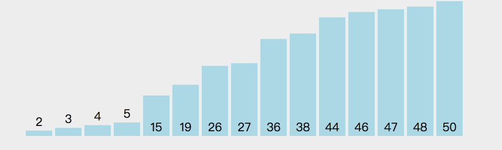
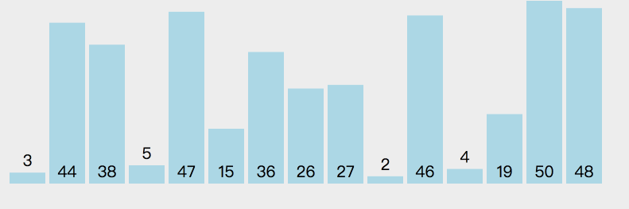
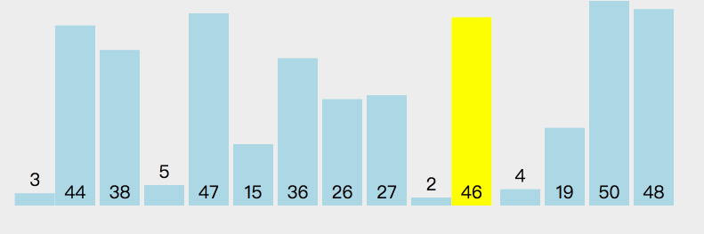
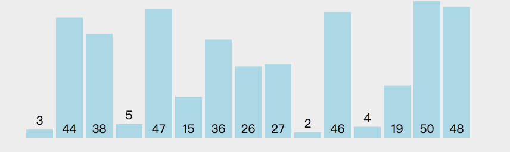
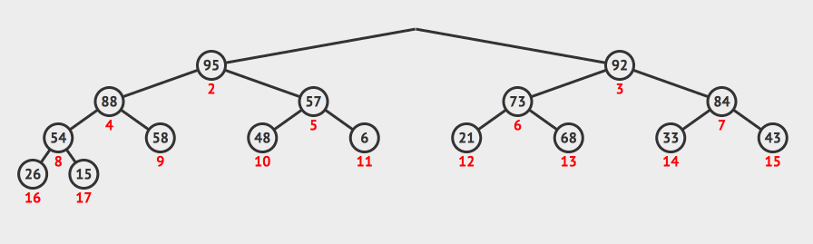
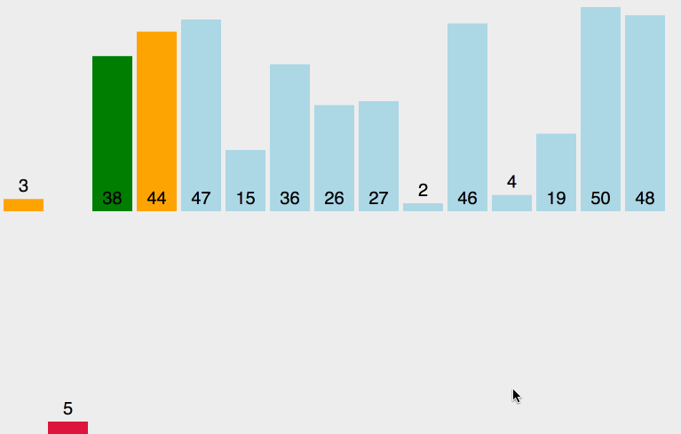
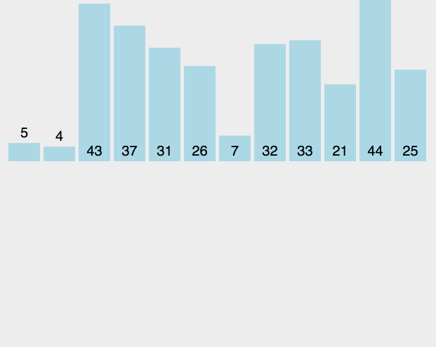
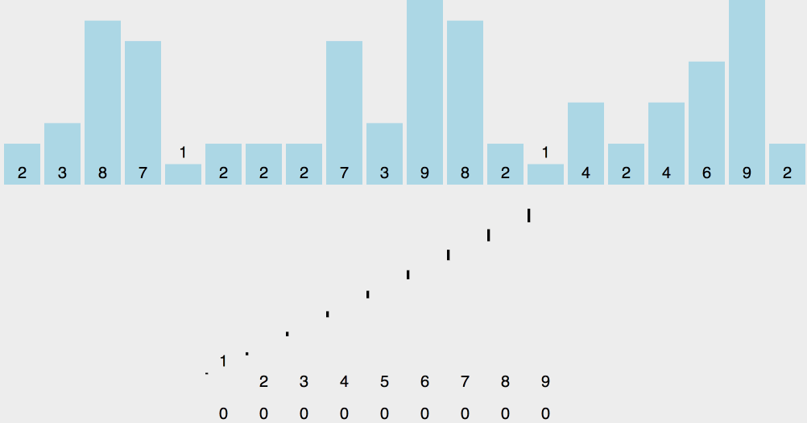
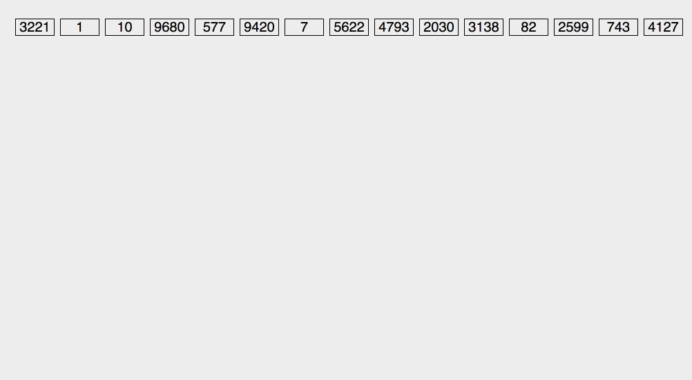

# 内部排序算法

```
python：3.6.2
```

## 前言

​	排序算法是计算机中最基础的算法，很多高级算法都依赖于此；

> **排序算法的稳定性**
>
> ​	如果待排序的数列中，相同的元素在排序前后相对顺序不变，即为稳定；
>
> ​	例如待排序列$[1,2_{a},5,3,2_{b}]$，如果排序之后，$2_{a}$依然在$2_{b}$的前面，就表示稳定；

​	算法的判断条件很重要，更改了条件，稳定的排序也会变得不稳定，如将冒泡的比较变成$\ge$。

​	一图胜千言，在下面搜集了一些简单的示例图，使用gif录屏器制作(算法可视化参见见参考文献)。

## 1、排序算法的分类

​	排序算法的理论：

> - [计算复杂性理论](https://zh.wikipedia.org/wiki/%E8%AE%A1%E7%AE%97%E5%A4%8D%E6%9D%82%E6%80%A7%E7%90%86%E8%AE%BA)
> - [大O符号](https://zh.wikipedia.org/wiki/%E5%A4%A7O%E7%AC%A6%E5%8F%B7)
> - [全序关系](https://zh.wikipedia.org/wiki/%E5%85%A8%E5%BA%8F%E5%85%B3%E7%B3%BB)
> - [列表](https://zh.wikipedia.org/w/index.php?title=%E5%88%97%E8%A1%A8_(%E8%AE%A1%E7%AE%97%E5%99%A8)&action=edit&redlink=1)
> - [稳定性](https://zh.wikipedia.org/wiki/%E6%8E%92%E5%BA%8F%E7%AE%97%E6%B3%95#.E7.A8.B3.E5.AE.9A.E6.80.A7)
> - [比较排序](https://zh.wikipedia.org/wiki/%E6%AF%94%E8%BE%83%E6%8E%92%E5%BA%8F)
> - [自适应排序](https://zh.wikipedia.org/w/index.php?title=%E8%87%AA%E9%80%82%E5%BA%94%E6%8E%92%E5%BA%8F&action=edit&redlink=1)
> - [排序网络](https://zh.wikipedia.org/w/index.php?title=%E6%8E%92%E5%BA%8F%E7%BD%91%E7%BB%9C&action=edit&redlink=1)
> - [整数排序](https://zh.wikipedia.org/w/index.php?title=%E6%95%B4%E6%95%B0%E6%8E%92%E5%BA%8F&action=edit&redlink=1)

​	根据排序的方法：插入、交换、选择、合并等, 将排序进行划分：

| 排序方法 | 排序算法                                                     |
| -------- | ------------------------------------------------------------ |
| 交换排序 | 冒泡排序    鸡尾酒排序    奇偶排序    梳排序    侏儒排序    快速排序    臭皮匠排序    Bogo排序 |
| 选择排序 | 选择排序    堆排序    平滑排序    笛卡尔树排序    锦标赛排序    圈排序 |
| 插入排序 | 插入排序    希尔排序    伸展排序    二叉查找树排序    图书馆排序    耐心排序 |
| 归并排序 | 归并排序    梯级归并排序    振荡归并排序    多相归并排序    列表排序 |
| 分布排序 | 美国旗帜排序    珠排序    桶排序    爆炸排序    计数排序    鸽巢排序    相邻图排序    <br />基数排序    闪电排序    插值排序 |
| 并发排序 | 双调排序器    Batcher归并网络    两两排序网络                |
| 混合排序 | 块排序    Tim排序    内省排序    Spread排序    J排序         |
| 其他     | 拓扑排序    煎饼排序    意粉排序                             |


下面是常用的算法列表：

> - 冒泡排序
>   - 直接冒泡排序
>   - 鸡尾酒排序
>   - 梳排序
> - 选择排序
> - 插入排序
>   - 直接插入排序
>   - 二分插入排序
>   - 希尔排序
> - 归并排序
> - 堆排序
> - 快速排序
>
>
> - 计数排序
> - 基数排序
> - 桶排序


| 算法     |       最坏时间复杂度       | 最佳时间复杂度 | 平均时间复杂度 |     空间复杂度     | 稳定性 |
| -------- | :------------------------: | :------------: | :------------: | :----------------: | :----: |
| 冒泡排序 |         $O(n^{2})$         |     $O(n)$     |   $O(n^{2})$   |       $O(1)$       |  稳定  |
| 选择排序 |         $O(n^{2})$         |   $O(n^{2})$   |   $O(n^{2})$   |        O(1)        | 不稳定 |
| 插入排序 |         $O(n^{2})$         |     $O(n)$     |   $O(n^{2})$   |       $O(1)$       |  稳定  |
| 希尔排序 | $O(nlog(n)) \sim O(n^{2})$ |  $O(n^{1.5})$  |   $O(n^{2})$   |       $O(1)$       | 不稳定 |
| 堆排序   |        $O(nlog(n))$        |  $O(nlog(n))$  |  $O(nlog(n))$  |       $O(1)$       | 不稳定 |
| 归并排序 |        $O(nlog(n))$        |  $O(nlog(n))$  |  $O(nlog(n))$  |       $O(n)$       |  稳定  |
| 快速排序 |         $O(n^{2})$         |  $O(nlog(n))$  |  $O(nlog(n))$  | $O(logn)\sim O(n)$ | 不稳定 |
| 计数排序 |          $O(n+m)$          |    $O(n+m)$    |    $O(n+m)$    |     $O(n + m)$     |  稳定  |
| 基数排序 |          $O(k*n)$          |    $O(k*n)$    |    $O(k*n)$    |      $O(k*n)$      |  稳定  |
| 桶排序   |           $O(n)$           |     $O(n)$     |     $O(n)$     |       $O(m)$       | 不稳定 |

## 2、交换排序

### 2.1 冒泡排序

   `Bubble Sort`

#### 2.1.1 直接冒泡排序

 

​	冒泡排序如上图所示，给定一个待排序列，从前往后依次扫描，将最大的元素放到最后面正确的位置，已经放到正确位置的序列在下一次扫描中就不会继续比对。

> 待排序列：[4,3,1,2]
>
> - [3,1,2,==4==]
>
> - [1,2,==3,4==]
>
> - [1,==2,3,4==]
>
> - [==1,2,3,4==]
>
>   如上面的简单序列所示，黄色的表示已经排好的序列
>
>   实际上，我们可以看到，最后一次排序并没有进行元素交换，所以，我们可以设置一个标志位，当本次比对没有进行数据交换的时候，就表明已经有序，跳出程序。
>
>   ​

```python
def bubble_sort(l_A):
    n = len(l_A)
    for i in range(0,n):
        for j in range(0,n-i-1):
            if l_A[j] > l_A[j + 1]:
                l_A[j + 1] , l_A[j] = l_A[j] , l_A[j + 1]
    return l_A

def bubble_sort_enhance(l_A):
    n = len(l_A)
    swap_flag = 0
    for i in range(0,n):
        swap_flag = 0
        for j in range(0,n-i-1):
            if l_A[j] > l_A[j + 1]:
                swap_flag = 1
                l_A[j + 1] , l_A[j] = l_A[j] , l_A[j + 1]
        if swap_flag == 0:
            break
    return l_A
if __name__ == '__main__':
    A = [6,5,4,3,2,1]
    A_str = ",".join([str(i) for i in A])
    sorted_A = bubble_sort_enhance(A)
    sorted_A_str = ",".join([str(i) for i in sorted_A])
    print("待排序列：",A_str)
    print("已排序列：",sorted_A_str)
```


#### 2.1.2 鸡尾酒排序

​	在调制鸡尾酒的过程中，需要来回摇晃，鸡尾酒算法也叫搅拌排序，涟漪排序

​	鸡尾酒排序是冒泡排序的简单改进，直接冒泡排序是单向的，而鸡尾酒算法则是进行双向排序；

> 待排序列：[4,3,2,1]
>
> - [3,2,1,==4==]
>
> - [==1==,3,2,==4==]
>
> - [==1==,2,==3,4==]
>
> - [==1,2,3,4==]
>
>   如上图所示，首先进行一次最大数冒泡，将最大数放到最后面，然后进行一次最小数冒泡，将最小数放到左面；
>
>   鸡尾酒排序在完全无序的情况下，与直接冒泡排序并无差别，同样的，我们也设置一个交换标志位，在没有交换的情况下，直接跳出。

```python
def cocktail_sort(l_A , n):
    left = 0
    right = n - 1
    swap_flag = 1
    while left < right:
        if swap_flag:
            for i in range(left,right):
                swap_flag = 0
                if l_A[i] > l_A[i + 1]:
                    swap_flag = 1
                    l_A[i] , l_A[i + 1]  = l_A[i + 1] , l_A[i]
            right = right - 1

            for i in range(right,left,-1):
                if l_A[i] < l_A[i - 1]:
                    swap_flag = 1
                    l_A[i] , l_A[i - 1]  = l_A[i - 1] , l_A[i]
            left = left + 1
        else:
            break

    return l_A
if __name__ == '__main__':
    A = [6,5,4,3,2,1]
    A_str = ",".join([str(i) for i in A])
    sorted_A = cocktail_sort(A,len(A))
    sorted_A_str = ",".join([str(i) for i in sorted_A])
    print("待排序列：",A_str)
    print("已排序列：",sorted_A_str)
```

#### 2.1.3 梳排序

​	`Comb Sort`

​	梳排序也是一种冒泡排序的改进方法，与希尔排序的思想类似，采用不同的增量序列，将待排序列划分成多个子序列，然后将每个子序列使用冒泡排序，最后一次的间隔一定是1，保证最终排序。

​	生成子序列的间隔一般是取待排序列长度递归除以==1.3==得到，例如长度为6的序列，其递减增量序列为：

```
6/1.3 = 4.62 => 4
4/1.3 = 3.07 => 3
3/1.3 = 2.31 => 2
2/1.3 = 1.54 => 1
最终序列为：[4,3,2,1]
```

> 待排序列：[6,5,4,3,2,1]
>
> - [2,1,4,3,6,5]   ==使用间隔4==
>
> - [2,1,4,3,6,5]   ==使用间隔3==
>
> - [2,1,4,3,6,5]   ==使用间隔2==
>
> - [1,2,3,4,5,6]   ==使用间隔1==
>
>   如上所示，使用不同的间隔的情况

```python
def comb_sort(l_A):
    size = len(l_A)
    gap = int(size/1.3)
    while gap >= 1 :
        for i in range(0,size - gap):
            if l_A[i] > l_A[i + gap]:
                l_A[i] , l_A[i + gap] = l_A[i + gap] , l_A[i]
        gap = int(gap/1.3)
    return l_A
if __name__ == '__main__':
    A = [6,5,4,3,2,1]
    A_str = ",".join([str(i) for i in A])
    sorted_A = comb_sort(A)
    sorted_A_str = ",".join([str(i) for i in sorted_A])
    print("待排序列：",A_str)
    print("已排序列：",sorted_A_str)
```


### 2.2 快速排序

​		`Quick Sort`

#### 2.2.1 快速排序



​	快速排序算法分治策略(Divide and Conquer)，将一个序列分成两个序列，然后选取基准，使用基准，将小于等于基准的放到左面，大于等于基准的数，放到右面；

我们来看这样的处理顺序：

- 判断待处理的数组中有多少元素，如果只有一个，返回


- 选取基准，利用基准将数组分成两部分，进行划分，小于等于基准的在左面，大于基准的在右面
- 将基准左面的数组重新执行第一步
- 将基准右面的数组重新执行第一步


> 待排序列：[6,5,4,3,2,1]
>
> - ==下标 5 基准 1==
> - [1, 5, 4, 3, 2, 6]
> - ==下标 5 基准 6==
> - [1, 5, 4, 3, 2, 6]
> - ==下标 4 基准 2==
> - [1, 2, 4, 3, 5, 6]
> - ==下标 4 基准 5==
> - [1, 2, 4, 3, 5, 6]
> - ==下标 3 基准 3==
> - [1, 2, 3, 4, 5, 6]
>
> 如上所示，目前基准选择的是最右面的元素，第一次，选择1作为基准，第二次选择6作为基准，一次类推；

```python
def partation(l_A , left , right):
    pivot = l_A[right]
    pivot_index = left
    # print('下标',right,'基准',pivot)
    for i in range(left, right):
        if l_A[i] <= pivot:
            l_A[i] ,l_A[pivot_index] = l_A[pivot_index], l_A[i]
            pivot_index += 1
    if pivot_index != right:
        l_A[pivot_index] , l_A[right] =  l_A[right] ,l_A[pivot_index]
    # print(l_A)
    return pivot_index

def quick_sort(l_A, left , right):
    if left >= right:
        return
    pivot_index = partation(l_A ,left, right)
    quick_sort(l_A,left,pivot_index -1)
    quick_sort(l_A,  pivot_index+1 , right)

if __name__ == '__main__':
    A = [6,5,4,3,2,1]
    A_str = ",".join([str(i) for i in A])
    quick_sort(A,0,len(A)-1)
    sorted_A_str = ",".join([str(i) for i in A])
    print("待排序列：",A_str)
    print("已排序列：",sorted_A_str)
```


#### 2.2.2 随机快速排序



​	随机快速排序与快速排序的主要区别就在于基准的选择上，随机快排是随机的选择基准，然后

> 待排序列：[6,5,4,3,2,1]
>
> - ==下标 4 基准 2==
>
> - [1, 2, 4, 3, 6, 5]
>
> - ==下标 5 基准 5==
>
> - [1, 2, 4, 3, 5, 6]
>
> - ==下标 2 基准 4==
>
> - [1, 2, 3, 4, 5, 6]
>
>   如上所示，

```python
import random
def partation(l_A , left , right):
    p = left + int((right - left + 1) * random.random())
    l_A[p] ,l_A[right] = l_A[right], l_A[p]
    pivot = l_A[right]
    # print('下标',p,'基准',pivot)
    pivot_index = left
    for i in range(left, right):
        if l_A[i] <= pivot:
            l_A[i] ,l_A[pivot_index] = l_A[pivot_index], l_A[i]
            pivot_index += 1
    if pivot_index != right:
        l_A[pivot_index] , l_A[right] =  l_A[right] ,l_A[pivot_index]
    # print(l_A)
    return pivot_index

def quick_sort(l_A, left , right):
    if left >= right:
        return
    pivot_index = partation(l_A ,left, right)
    quick_sort(l_A,left,pivot_index -1)
    quick_sort(l_A,  pivot_index+1 , right)

if __name__ == '__main__':
    A = [6,5,4,3,2,1]
    A_str = ",".join([str(i) for i in A])
    quick_sort(A,0,len(A)-1)
    sorted_A_str = ",".join([str(i) for i in A])
    print("待排序列：",A_str)
    print("已排序列：",sorted_A_str)
```


## 3、选择排序

### 3.1 选择排序

​	`Selection Sort`



​	插入排序的基本思路就是从未排序的序列里面选出一个最小的，然后将至放到已排序列的尾部后面元素交换位置，一直到待排序列为0.

> 待排序列：[5,4,3,2,1]
>
> - [==1==,4,3,2,5]
>
> - [1,==2==,3,4,5]
>
> - [1,2,==3==,4,5]
>
> - [1,2,3,==4==,5]
>
> - [1,2,3,4,==5==]
>
>   如上所示，第一次，扫描全部序列，将最小的1选出来，然后将1与首位的数字5进行交换，然后第二次将最小数字2与数字4进行交换。

```python
def selection_sort(l_A):
    n = len(l_A)
    for i in range(0,n):
        swap_num = i
        for j in range(i + 1,n):
            if l_A[j] < l_A[i]:
                swap_num = j
        if swap_num != i:
            l_A[i] , l_A[swap_num] = l_A[swap_num], l_A[i]
    return l_A

if __name__ == '__main__':
    A = [6,5,4,3,2,1]
    A_str = ",".join([str(i) for i in A])
    sorted_A = selection_sort(A)
    sorted_A_str = ",".join([str(i) for i in sorted_A])
    print("待排序列：",A_str)
    print("已排序列：",sorted_A_str)
```

### 3.2 堆排序

​	`Heap Sort`



​	堆是完全二叉树，分为最大堆和最小堆，最大堆中，根节点都比其子节点要大，而最小堆中，根节点都比其子节点要小；

​	最大堆的应用场景，例如带有优先级的排队进程，当系统空闲，优先处理优先级高的；

​	最大堆主要有这样几个注意点：

- 建堆

- 删除根节点

- 插入一个节点


  使用堆排序，主要是利用根节点一直是最大的性质，将根节点与最后面的儿子节点位置对调，堆的大小减一， 然后进行堆调整，然后再将根节点与莫为节点对调，再调整成堆，然后循环递归；

所以，堆排序主要是下面几个步骤：

- 将数组调整成堆
- 将根元素与堆的末尾元素对调，调整堆
- 重复第二步，直到堆的大小为1为止。


> 待排序列：[6,5,4,3,2,1]
>
> - [5,4,3,2,1,==6==]
>
> - [4,3,2,1,==5,6==]
>
> - [3,2,1,==4,5,6==]
>
> - [2,1,==3,4,5,6==]
>
> - [==1,2,3,4,5,6==]
>
>   这一个较为特殊，默认就是堆的形式，第一步是调整成堆

```python
def heapify(l_A, node , size):
    left_child = 2 * node + 1
    right_child = 2 * node + 2
    max = node
    if left_child < size and l_A[max] < l_A[left_child] :
        max = left_child
    if right_child < size and l_A[max] < l_A[right_child] : 
        max = right_child
    if max != node:
        l_A[max] , l_A[node] = l_A[node],l_A[max]
        heapify(l_A, max , size)

def build_heap(l_A, size):
    heap_size = (size - 1) // 2
    while heap_size >= 0 :
        heapify(l_A, heap_size , size)
        heap_size -= 1
    return l_A

def heap_sort(l_A):
    size = len(l_A)
    temp = build_heap(l_A, size)
    while size > 1:
        size -= 1
        l_A[0],l_A[size] = l_A[size],l_A[0] 
        heapify(l_A,0, size)
    return temp

if __name__ == '__main__':
    A = [6,5,4,3,2,1]
    A_str = ",".join([str(i) for i in A])
    sorted_A = heap_sort(A)
    sorted_A_str = ",".join([str(i) for i in sorted_A])
    print("待排序列：",A_str)
    print("已排序列：",sorted_A_str)
```


## 4、插入排序

### 4.1 直接插入排序



​	直接插入排序也是将待排序列分成两部分，其一是左面排好序的，然后是右面待排序，首先将待排序的第一个元素取出来，与排好序的序列机芯从右向左的比对，如果小于，则将此元素向右移动，一直找到当前元素应该放在的位置。

> 待排序列：[5,4,3,2,1]
>
> - [==4,5==,3,2,1]
>
> - [==3,4,5==,2,1]
>
> - [==2,3,4,5==,1]
>
> - [==1,2,3,4,5==]
>
>   如上，以高亮表示排好序的元素，然后第一次从待排序中，取出4，然后与5比较，将5向后移位，然后将4放到首位，剩下元素依次进行。

```python
def insertion_sort(l_A):
    n = len(l_A)
    for i in range(1,n):
        get = l_A[i]
        j = i - 1
        while j >= 0 and l_A[j] > get:
            l_A[j+1] = l_A[j]
            j = j - 1
        l_A[j+1] = get
    return l_A

if __name__ == '__main__':
    A = [6,5,4,3,2,1]
    A_str = ",".join([str(i) for i in A])
    sorted_A = insertion_sort(A)
    sorted_A_str = ",".join([str(i) for i in sorted_A])
    print("待排序列：",A_str)
    print("已排序列：",sorted_A_str)
```

### 4.2 二分插入排序

​	二分插入排序是直接插入排序的改进版，主要针对于需要比对次数多的场景，例如有一个较小的元素，需要比对多次才能确定要插入的位置，使用二分法，提高查找效率。

> 待排序列：[6,5,4,3,2,1]
>
> - [==5, 6==, 4, 3, 2, 1]
>
> - [==4, 5, 6==, 3, 2, 1]
>
> - [==3, 4, 5, 6==, 2, 1]
>
> - [==2, 3, 4, 5, 6==, 1]
>
> - [==1, 2, 3, 4, 5, 6==]
>
>   与前面基本相同，唯一不同的就是，在寻找要插入的位置的时候，使用了二分查找法。

```python
def binary_insertion_sort(l_A):
    n = len(l_A)
    for i in range(1, n):
        get = l_A[i]
        left = 0
        right = i -1
        while left <= right:
            mid = (left+right)//2
            if l_A[i] < l_A[mid]:
                right = mid - 1
            else:
                left = mid + 1
        for j in range(i,left,-1):
            l_A[j] = l_A[j-1]
        l_A[left] = get
    return l_A
if __name__ == '__main__':
    A = [6,5,4,3,2,1]
    A_str = ",".join([str(i) for i in A])
    sorted_A = binary_insertion_sort(A)
    sorted_A_str = ",".join([str(i) for i in sorted_A])
    print("待排序列：",A_str)
    print("已排序列：",sorted_A_str)
```


### 4.3 希尔排序

​	前面两种插入排序需要移动元素的次数还是太多，是否能够一次将元素移动多个位置，尽可能接近他本来的位置，希尔排序的基本思路就是使用一个递减增量，将待排序列分成多个子序列，进行插入排序，然后最后使用一次增量为1的直接插入排序。

> 希尔排序是基于插入排序的以下两点性质而提出改进方法的：
>
> - 插入排序在对几乎已经排好序的数据操作时，效率高，即可以达到线性排序的效率。
> - 但插入排序一般来说是低效的，因为插入排序每次只能将数据移动一位。


> 待排序列：[6,5,4,3,2,1]
>
> 增量序列：[4,1]
>
> 1. 首先，取出增量4，将待排序列分成几个子序列：
>
>    - [6,2]
>    - [5,1]
>    - [4]
>    - [3]
>
>    分成了4个子序列，然后分别使用插入排序，对这4个子序列进行排序
>    得到下面的结果：
>    [2,1,4,3,6,5]
>
>    可以看到，6,5直接被移动到靠近他们办类的位置上了；
>
> 2. 然后，使用增量1，再来使用插入排序
>
> - [==1, 2==, 4, 3, 6, 5]
> - [==1, 2, 4==, 3, 6, 5]
> - [==1, 2, 3, 4==, 6, 5]
> - [==1, 2, 3, 4, 6==, 5]
> - [==1, 2, 3, 4, 5, 6==]

```python
def shell_sort(l_A):
    n = len(l_A)
    h = n // 2 
    while h >= 1:
        for i in range(h,n):
            get = l_A[i]
            j = i - h
            while j >= 0 and l_A[j] > get:
                l_A[j + h] = l_A[j]
                j -= h
            l_A[j+h] = get
        h = h // 2
    return l_A
if __name__ == '__main__':
    A = [6,5,4,3,2,1]
    A_str = ",".join([str(i) for i in A])
    sorted_A = shell_sort(A)
    sorted_A_str = ",".join([str(i) for i in sorted_A])
    print("待排序列：",A_str)
    print("已排序列：",sorted_A_str)
```

​	上面采用的增量序列为[3,1]，是利用`h = n // 2`获得，我们可以使用增量函数，或者直接使用增量序列。


## 5、归并排序



​	归并排序是建立在分治法上的典型应用，分为递归实现和非递归实现

> 基本步骤：
>
> - 创建一个数组，能够存放两个已经有序的数组
> - 两个分别指向两个有序数组起始位置的指针
> - 比较指针指向的两个元素，将其中较小的放入和数组，指针加一
> - 重复上面步骤，直到指针指向有序数组的末尾
> - 将另一个未指向末尾的数组放入到和数组中

> 递归实现：[6,5,4,3,2,1]
>
> - [5, 6]
>
> - [4, 5, 6]
>
> - [2, 3]
>
> - [1, 2, 3]
>
> - [1, 2, 3, 4, 5, 6]
>
>   上面为归并函数一次处理的有序数组，第一个表示将[6],[5]进行归并，以此类推；
>
> - [5, 6, 4, 3, 2, 1]
>
> - [4, 5, 6, 3, 2, 1]
>
> - [4, 5, 6, 2, 3, 1]
>
> - [4, 5, 6, 1, 2, 3]
>
> - [1, 2, 3, 4, 5, 6]
>
>   上面表示待排数字的依次变化


> 非递归实现：[6,5,4,3,2,1]
>
> - [5, 6]
>
> - [3, 4]
>
> - [1, 2]
>
> - [3, 4, 5, 6]
>
> - [1, 2, 3, 4, 5, 6]
>
>   上面表示非递归模式下，依次进行处理的有序数列；

```python
def merge(l_A, left, mid, right):
    temp = []
    i = left
    j = mid + 1
    while i <= mid and j <= right:
        if l_A[i] <= l_A[j]:
            temp.append(l_A[i])
            i += 1
        else:
            temp.append(l_A[j])
            j += 1
    while i <= mid:
        temp.append(l_A[i])
        i += 1
    while j <= right:
        temp.append(j)
        j += 1
    l_A[left:right+1] = temp
    return l_A
def merge_recursion(l_A, left , right):
    if left == right:
        return
    mid = (left + right) // 2
    merge_recursion(l_A,left,mid)
    merge_recursion(l_A,mid+1,right)
    merge(l_A,left,mid,right)
def merge_iteration(l_A):
    length = len(l_A)
    i = 1
    while i < length :
        left = 0
        while left + i < length:
            mid = left + i -1
            if mid + i < length:
                right = mid + i
            else:
                right = length - 1
            merge(l_A,left,mid,right)
            left = right + 1
        i *= 2
        # print(l_A)
    return l_A
if __name__ == '__main__':
    A = [6,5,4,3,2,1]
    A_str = ",".join([str(i) for i in A])
    # merge_recursion(A,0,len(A)-1)
    merge_iteration(A)
    sorted_A_str = ",".join([str(i) for i in A])
    print("待排序列：",A_str)
    print("已排序列：",sorted_A_str)
```


## 6、分布排序

### 6.1 计数排序

​	`Counting Sort`



​	计数排序的思想：假如现在有10个数，[2,3,4,5,1,2,3,4,2,5]，如何能直接确定数字2在排好序的数组里面的位置呢？假如现在已经将数组中所有小于2的数的总数量统计了，如上面的数组，小于2的数一共有1个，那么在排好序的数组里面，2是从下标为1的数组中开始存储，占有的存储单元就是2个个数。


计数排序的步骤：

- 待排数组为A


- 初始化数组B，数据全部为0，数组大小为待排数组中最大的元素+1
- 扫描待排数组，统计元素个数，存放在数组B对应的下标中，例如3的个数，存放在B[3]中
- 然后，数组B中的每一个元素都是<=当前下标数据之和
  - 举个例子，如果B=[1,0,2,3,4,5]
  - B[0] = B[0]
  - B[1] = B[1]+B[0]
  - B[2] = B[2]+B[1]+B[0]
  - 使用循环控制的话，就能够使用如下表示：
  - B[0] = B[0]
  - B[1] = B[1]+B[0]
  - B[2] = B[2]+B[1]
  - 然后，我们就得到了每一个元素在排好序的数组中的最后一个位置
- 然后，创建数组C，与待排数组大小相同
- 从后向前扫描A，将出现的数放到C，存放位置为B[i],然后将i减一，表示下一个数字i的位置


> 待排数组：[6,5,4,3,2,1]
>
> - 数组B：[0,1,1,1,1,1,1]
>
> - 累加B：[0,1,2,3,4,5,6]
>
> - 数组C：[1,0,0,0,0,0]
>
> - 数组C：[1,2,0,0,0,0]
>
> - 数组C：[1,2,3,0,0,0]
>
> - 数组C：[1,2,3,4,0,0]
>
> - 数组C：[1,2,3,4,5,0]
>
> - 数组C：[1,2,3,4,5,6]
>
>   需要注意的是，我们计数是从1开始，二存储的时候，下标从0开始，所以需要将数组B中的数字减一，作为存储在C中的下标。

```python
def counting_sort(l_A):
    '''
        l_A：待排数组
    '''
    size = len(l_A)
    nums = max(l_A) + 1
    temp_position_len = nums + 1
    temp_position = [0 for i in range(temp_position_len)]
    temp_position_right = [0 for i in range(size)]
    for i in range(size):
        temp_position[l_A[i]] += 1
    for i in range(1, len(temp_position)):
        temp_position[i] += temp_position[i-1]
    for i in range(size-1,-1,-1):
        temp_position_right[temp_position[l_A[i]] -1] = l_A[i]
        temp_position[l_A[i]] -= 1
    l_A = temp_position_right
    return l_A
if __name__ == '__main__':
    A = [6,5,4,3,2,1]
    A_str = ",".join([str(i) for i in A])
    sorted_A = counting_sort(A)
    sorted_A_str = ",".join([str(i) for i in sorted_A])
    print("待排序列：",A_str)
    print("已排序列：",sorted_A_str)
```


### 6.2 基数排序

​	`Radix Sort`

​	基数排序，其原理为利用数字不同位置的数码，进行排序；假如有这样的数组，[12,45,6,77,88]，我们发现数字最多两位，数码有10个，也就是`0~9`，我们创建10个数组，分别代表`0~9`, 第一次，将最低位相同的数字放到同样的数组里面，也就是最低位为1的数字放到表示1的数组中，将待排数组从前往后扫描，然后从第0个数组开始，将数据取出来，为了保障是稳定性，取出数据的时候，从后往前取出来，然后在扫描第二次，判断第二个数码；

> 待排数组: [89,88,77,6,5,4,3,2,1]
>
> 第一次扫描：
>
> 0数组：[]
>
> 1数组：[1]
>
> 2数组：[2]
>
> 3数组：[3]
>
> 4数组：[4]
>
> 5数组：[5]
>
> 6数组：[6]
>
> 7数组：[77]
>
> 8数组：[88]
>
> 9数组：[89]
>
> 放回待排数组：[1,2,3,4,5,6,77,88,89]
>
> 第2次扫描：
>
> 0数组：[1,2,3,4,5,6]
>
> 1数组：[]
>
> 2数组：[]
>
> 3数组：[]
>
> 4数组：[]
>
> 5数组：[]
>
> 6数组：[]
>
> 7数组：[]
>
> 8数组：[88,89]
>
> 9数组：[]
>
> 放回待排数组：[1,2,3,4,5,6,77,88,89]

​	根据上面的思路，有两种实现思路：

> 第一种：
>
> ​	创建多个数组，每个数组都代表一个数码，按照最大的数的位数进行循环操作
>
> 第二种：
>
> ​	我们发现，在按照数码放到不同的素组里的思路，与前面的计数有些相似，如果按照不同的位数，进行计数排序，并且同时保证稳定性，也可以实现我们想要的操作。

**第一种**

```python
def get_digit(digit,position):
    num = digit // 10 ** position % 10
    return num     
    
def radix_sort(l_A, digits, nums):
    size = len(l_A)
    temp_nums = [[] for i in range(digits)]
    for i in range(nums):
        for j in range(size):
            temp_nums[get_digit(l_A[j],i)].append(l_A[j])
        l_A = []
        for j in range(digits):
            for temp_item in range(len(temp_nums[j])):
                l_A.append(temp_nums[j].pop(0))
    return l_A

if __name__ == '__main__':
    # A = [6,5,4,3,2,1]
    A = [33,44,13,6,7,8,33,45,90]
    A_str = ",".join([str(i) for i in A])
    sorted_A = radix_sort(A,10,2 )
    sorted_A_str = ",".join([str(i) for i in sorted_A])
    print("待排序列：",A_str)
    print("已排序列：",sorted_A_str)
```

**第二种**

```python
def get_digit(digit,position):
    num = digit // 10 ** position % 10
    return num     
    
def counting_sort(l_A ,nums,position,size):
    temp_position_len = nums
    temp_position = [0 for i in range(temp_position_len)]
    temp_position_right = [0 for i in range(size)]
    for i in range(size):
        temp_position[get_digit(l_A[i],position)] += 1
    for i in range(1, len(temp_position)):
        temp_position[i] += temp_position[i-1]
    for i in range(size-1,-1,-1):
        temp_position_right[temp_position[get_digit(l_A[i],position)] -1] = l_A[i]
        temp_position[get_digit(l_A[i],position)] -= 1
    l_A = temp_position_right
    return l_A

def radix_sort(l_A,digits, nums):
    '''
        l_A：待排数组
        digits：数码个数
        nums：最大数的位数
    '''
    size = len(l_A)
    for i in range(nums):
        l_A = counting_sort(l_A, digits,i, size)
    return l_A
if __name__ == '__main__':
    A = [33,44,1000,13,6,7,8,33,45,990]
    A_str = ",".join([str(i) for i in A])
    sorted_A = radix_sort(A,10,4 )
    sorted_A_str = ",".join([str(i) for i in sorted_A])
    print("待排序列：",A_str)
    print("已排序列：",sorted_A_str)
```

### 6.3 鸽巢排序

​	`Pigeonhole Sort`

​	鸽巢排序是一中种高速排序，但是需要很大的辅助空间；

​	例如待排数组：[5,3,2,6,33,77]，就需要77-2+1=76个辅助空间

​	排序思路：

- 申请辅助空间
- 得到数组中的最大、最小值
- 扫描数组，将每个数减去最小值的数作为下标，将此下标中的数增加1
- 扫描辅助数组，将对应下标加上最小值，得到原来的数，放入待排数组

> 待排数组：[5,3,2,5,7]
>
> 辅助空间：[0,0,0,0,0,0]
>
> 最大值：7
>
> 最小值：2
>
> 扫描数组，处理辅助数组：[1,1,0,2,0,1]
>
> 扫描辅助数组，得到排序数组：[2,3,5,5,7]

​	由上面可得，如果数据范围太大，或者说重复的数据很少，使用鸽巢排序不划算，只有在差值（或者可被映射在差值）很小的范围内的数值排序的情况下实用

```python
def pigeonhole_sort(l_A):
    size = len(l_A)
    if size > 1:
        max_value = max(l_A)
        min_value = min(l_A)
    else:
        return l_A

    assistant = [0 for i in range(max_value - min_value + 1)]
    for i in range(size):
        assistant[l_A[i]-min_value] += 1
    l_A = []
    for i in range(len(assistant)):
        while assistant[i] >= 1:
            l_A.append(min_value+i)
            assistant[i] -= 1
    return l_A

if __name__ == '__main__':
    A = [6,5,4,3,2,1]
    A_str = ",".join([str(i) for i in A])
    sorted_A = pigeonhole_sort(A)
    sorted_A_str = ",".join([str(i) for i in sorted_A])
    print("待排序列：",A_str)
    print("已排序列：",sorted_A_str)
```


### 6.4 桶排序

​	`Bucket Sort`

​	桶排序是将待排序列放到有限数量的桶里，然后在每个桶里，使用其他的排序算法，进行排序；桶由计数所决定；

​	基本思路：

- 确定桶的数量
  - 例如，我们输入的数据都在0到50之间，那么我们确定5个桶，`0~10`,`11~20`等
- 根据桶的数量，确定映射函数，也就是将能够确定相同的桶的依据
  - 例如，根据上面说的，我们设置数据的十位数作为分桶依据，映射函数就是`in/10`
- 将数据分开，放在不同的桶中，也就是记住不同的桶之间的边界数据
  - 比如说，使用计数算法，将不同的边界分开
- 在桶内使用排序算法进行排序

> 待排序列：[33,9,11,4,22,44,5,6]
>
> 桶的数量：5
>
> 映射函数：x//10   ==python中，`//`表示整除==
>
> 分桶：[9,4,5,6,11,22,33,44]
>
> 边界数据：[4,1,1,1,1]
>
> 桶内排序：[4,5,6,9,11,22,33,44]

```python
def map2bucket(number):
    return number // 10

def insert_sort(l_A,left,right):
    if left == right:
        return l_A
    length = right - left + 1
    for i in range(1,length):
        get = l_A[i]
        j = i-1
        while j >=0 and l_A[j] > get:
            l_A[j+1] = l_A[j]
            j -= 1
        l_A[j+1] = get
    return l_A
def counting_sort(l_A, nums):
    '''
        l_A：待排数组
        nums：桶的数量
    '''
    size = len(l_A)
    temp_position_len = nums
    temp_position = [0 for i in range(temp_position_len)]
    temp_position_right = [0 for i in range(size)]
    for i in range(size):
        temp_position[map2bucket(l_A[i])] += 1
    for i in range(1, len(temp_position)):
        temp_position[i] += temp_position[i-1]
    boundary = temp_position.copy()
    for i in range(size-1,-1,-1):
        temp_position_right[temp_position[map2bucket(l_A[i])] -1] = l_A[i]
        temp_position[map2bucket(l_A[i])] -= 1
    l_A = temp_position_right
    return l_A, boundary

def bucket_sort(l_A, bucket_nums):
    temp_l_A, boundary = counting_sort(l_A, bucket_nums)
    for i in range(bucket_nums):
        left = boundary[i]
        if left >= len(l_A):
            left = 0
        if i >= bucket_nums - 1 :
            right = boundary[0] - 1
        else:
            right = boundary[i+1] -1
        temp_l_A = insert_sort(temp_l_A, left,right)
    return temp_l_A

if __name__ == '__main__':
    A = [6,5,4,3,2,1,11,33,22,44]
    A_str = ",".join([str(i) for i in A])
    sorted_A = bucket_sort(A, 5)
    sorted_A_str = ",".join([str(i) for i in sorted_A])
    print("待排序列：",A_str)
    print("已排序列：",sorted_A_str)
```


## 7、参考资料

数据结构与算法动态可视化： https://visualgo.net/zh

可视化排序：http://panthema.net/2013/sound-of-sorting/#

wiki排序算法：[排序算法](https://zh.wikipedia.org/wiki/%E6%8E%92%E5%BA%8F%E7%AE%97%E6%B3%95)
